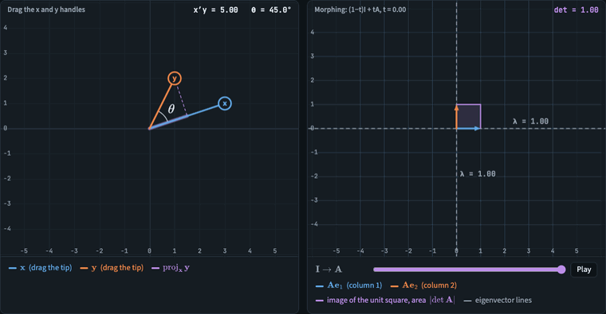
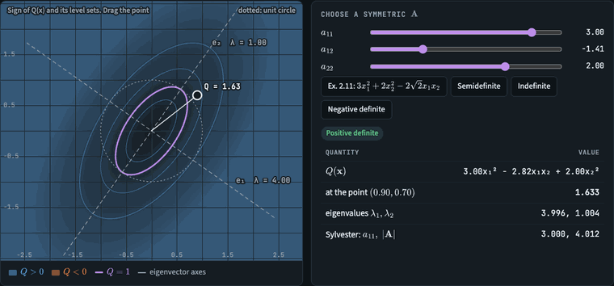
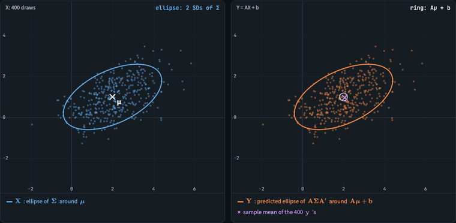

# Sample Geometry Lab

An interactive companion to **MATH 4424 Multivariate Analysis, Chapters 1–4**: data summaries and distances (Ch 1), the matrix tools (Ch 2), sample geometry and random sampling (Ch 3), and the multivariate normal (Ch 4). You drag points, rotate vectors and draw random samples, and every number on the page is recomputed live from what you see.

**▶ Live demo: https://joshrkhoo.github.io/sample-geometry-lab/**

It's one HTML file with no build step and no install. Open `index.html` in a browser, or use the link above.

---

## Demos

### 1.2 From a data matrix to x̄, S and R
Each row of **X** is a point. Drag one and watch x̄, **S** and **R** update. The shaded rectangles from x̄ to each point are the products (x_j1 − x̄₁)(x_j2 − x̄₂). Blue ones add to s₁₂ and orange ones subtract from it. Four preset data sets share the same x̄ and **S** but look nothing alike (AI Exploration 2).


### 1.4 Three rulers: Euclidean, standardised and Mahalanobis
P circles the centre at a fixed Euclidean distance while the standardised and Mahalanobis contours through it reshape. Then the units of x₁ change: the Euclidean distance moves, but the other two don't. The right panel shows the whitened view, where the Mahalanobis ellipse becomes a circle.


### 2.1 Vectors measure, matrices move
On the left, two draggable vectors show length, inner product, angle and the projection of **y** onto **x**. On the right, the plane morphs from **I** to **A**: the unit square becomes a parallelogram of area |det **A**|, and the dashed eigenvector lines are the directions that don't turn.



### 2.2 Quadratic forms and positive definiteness
The sign of Q(x) = x′Ax is shaded over the plane, with its level sets drawn on top. As a₁₂ grows, the level sets go from ellipses (positive definite) to hyperbolas (indefinite) once λ₂ crosses zero.



### 2.2 Inside S: spectral decomposition and square-root matrices
A unit circle is turned into the ellipse of **S** one step at a time: rotate by **P**′, stretch by **Λ**^½, then rotate back by **P**. The right panel shows the same 30 observations centred, standardised (**D**^−½, covariance **R**) and whitened (**S**^−½, covariance **I**).


### 2.3 Transforming a random vector: Y = AX + b
400 draws of **X** pushed through four transformations: the identity, the lecture's Z₁ = X₁ − X₂, Z₂ = X₁ + X₂, a rank-deficient **A** that flattens the cloud onto a line, and standardisation. The predicted ellipse of AΣA′ tracks the simulated cloud each time.



### 3.1 Rows vs columns: the mean is a projection, correlation is an angle
Drag an observation in the scatter plot (left). The right panel shows the same data as two column vectors in ℝ³. Each **y**ᵢ is projected onto **1**, which gives x̄ᵢ**1**. What's left over is the deviation vector **d**ᵢ, at right angles to **1**. The cosine of the angle between **d**₁ and **d**₂ is r₁₂, and the squared area of the shaded parallelogram is (n−1)²|S|.


### 3.1 Correlation is the cosine of an angle
This is AI Exploration-1 from the slides. Two centred vectors in ℝ⁵ are swept from θ = 0° (r = 1) through 90° (r = 0) to 180° (r = −1), and the scatter plot of the five observations follows.


### 3.2 x̄ and S are random too
The app draws repeated samples from N₂(μ, Σ). The sample means bunch up inside the Σ/n contour. The running average of s₁₁ settles on σ₁₁ with divisor n−1, and on (n−1)/n · σ₁₁ with divisor n.


### 3.4 Linear combinations and the Rayleigh quotient
Turn the direction **b** and watch each point's projection onto it. The chart underneath shows **b**′**S****b** swinging between λ₂ and λ₁, with the maximum at the first eigenvector.


### 4.1 The bivariate normal and conditioning
A density with χ²₂ probability ellipses. As the slice X₁ = x₁ sweeps across, the conditional density of X₂ slides along the regression line, but its width (σ₂₂(1 − ρ²)) never changes.


### 4.4–4.5 Checking normality
One observation is dragged across the cloud. Its marginal Q-Q plot still looks fine, but it climbs far above the line in the chi-square plot and gets flagged as a multivariate outlier (d² > χ²₂(0.005)).


### 4.6 Box-Cox
λ sweeps across the radiation data from Johnson & Wichern. The histogram and Q-Q plot straighten out as λ approaches the maximum-likelihood λ̂ ≈ 0.28.


---

## What's in each tab

| Tab | Lecture section | You can… |
|---|---|---|
| **x̄, S and R** | 1.2 | Drag, add or delete points, or edit the data matrix, and watch the signed rectangles behind s₁₂. Switch between divisors n and n−1, and compare four data sets that share the same x̄ and S |
| **Three distances** | 1.4 | Drag P and compare d_E, d_S and d_M with their contours. Change units, place P along or across the cloud, and load the lecture example (S = diag(4, 1), P = (2, 1)) |
| **Vectors & matrices** | 2.1 | Drag **x** and **y** (length, inner product, angle, projection, dependence). Edit or pick a 2×2 **A** and watch it map the plane, with its determinant as area, eigenvectors, and inverse |
| **Quadratic forms** | 2.2 | Shape a symmetric **A** and see the sign of x′Ax, its level sets, and Q on the unit circle bounded by λ₂ and λ₁. Includes Example 2.11 plus semidefinite, indefinite and negative-definite presets |
| **Inside S** | 2.2 | Build S^½ from a circle (rotate, stretch, rotate back), then compare centred, standardised (**R**) and whitened (**I**) data |
| **Y = AX + b** | 2.3 | Pick Σ, **A** and **b** and compare Aμ + b and AΣA′ with 400 simulated draws, including the lecture example and a rank-deficient **A** |
| **Rows vs columns** | 3.1 | Drag 3 observations, rotate the ℝ³ column view, switch between divisors n−1 and n, load textbook Example 3.2 or a degenerate data set |
| **Correlation is an angle** | 3.1 | Set θ and ‖**d**₂‖/‖**d**₁‖ and watch the five observations line up as r = cos θ goes from 1 to −1 |
| **Random sampling** | 3.2 | Set n, σ₁, σ₂, ρ and compare simulated E(x̄), Cov(x̄), E(S), E(Sₙ) with theory |
| **Generalized variance** | 3.3 | Shape S and read off \|S\|, tr(S), the eigenvalues and the ellipse area. Includes the three \|S\| = 9 matrices from Example 3.8 and a degenerate r = 1 case |
| **Linear combinations** | 3.4 | Drag **b** and **c** to see b′x̄, b′Sb and b′Sc, and watch b′Sb swing between λ₂ and λ₁ as **b** turns |
| **Bivariate normal** | 4.1 | Set σ₁, σ₂ and ρ and pick a 50/90/95/99% ellipse, checking coverage against 1000 simulated points. Drag the slice to see X₂ given X₁ next to the marginal |
| **Checking normality** | 4.4–4.5 | Normal, heavy-tailed, skewed, outlier and normal-marginals-only data. You get Q-Q plots with r_Q against the Table 4.2 critical points, and a chi-square plot that flags multivariate outliers. Every point can be dragged |
| **Box-Cox** | 4.6 | Slide λ or click the likelihood curve. You see the histogram and Q-Q plot of x^(λ), ℓ(λ) with λ̂ and an approximate 95% interval, and the radiation data plus three simulated sets with a known answer |

## Key formulas covered

### Chapter 1: summaries and distances

```math
\bar{\mathbf x}=\frac1n\sum_{j=1}^n\mathbf x_j,\qquad
s_{ik}=\frac1n\sum_{j=1}^n(x_{ji}-\bar x_i)(x_{jk}-\bar x_k),\qquad
r_{ik}=\frac{s_{ik}}{\sqrt{s_{ii}}\sqrt{s_{kk}}},\qquad
\mathbf R=\mathbf D^{-1/2}\mathbf S\,\mathbf D^{-1/2}
```

```math
d_E=\sqrt{(\mathbf x-\mathbf y)'(\mathbf x-\mathbf y)},\qquad
d_S=\sqrt{(\mathbf x-\mathbf y)'\mathbf D^{-1}(\mathbf x-\mathbf y)},\qquad
d_M=\sqrt{(\mathbf x-\mathbf y)'\mathbf S^{-1}(\mathbf x-\mathbf y)}
```

### Chapter 2: matrix algebra and random vectors

```math
\cos\theta=\frac{\mathbf x'\mathbf y}{\sqrt{\mathbf x'\mathbf x}\,\sqrt{\mathbf y'\mathbf y}},\qquad
\mathrm{proj}_{\mathbf x}\mathbf y=\frac{\mathbf y'\mathbf x}{\mathbf x'\mathbf x}\,\mathbf x,\qquad
\mathbf A\mathbf e=\lambda\mathbf e,\qquad
|\mathbf A-\lambda\mathbf I|=0
```

```math
\mathbf A=\mathbf P\boldsymbol\Lambda\mathbf P'=\sum_i\lambda_i\mathbf e_i\mathbf e_i',\qquad
\mathbf A^{1/2}=\mathbf P\boldsymbol\Lambda^{1/2}\mathbf P',\qquad
\lambda_{\min}\le\frac{\mathbf x'\mathbf A\mathbf x}{\mathbf x'\mathbf x}\le\lambda_{\max}
```

```math
E(\mathbf A\mathbf X+\mathbf b)=\mathbf A\boldsymbol\mu+\mathbf b,\qquad
\mathrm{Cov}(\mathbf A\mathbf X+\mathbf b)=\mathbf A\boldsymbol\Sigma\mathbf A'
```

### Chapter 3: sample geometry and random sampling

```math
\frac{\mathbf y_i'\mathbf 1}{\mathbf 1'\mathbf 1}\,\mathbf 1=\bar x_i\mathbf 1,\qquad
\mathbf d_i=\mathbf y_i-\bar x_i\mathbf 1,\qquad
\mathbf d_i'\mathbf d_k=(n-1)\,s_{ik},\qquad
\cos\theta_{ik}=r_{ik}
```

```math
E(\bar{\mathbf X})=\boldsymbol\mu,\qquad
\mathrm{Cov}(\bar{\mathbf X})=\tfrac1n\boldsymbol\Sigma,\qquad
E(\mathbf S)=\boldsymbol\Sigma,\qquad
E(\mathbf S_n)=\tfrac{n-1}{n}\boldsymbol\Sigma
```

```math
|\mathbf S|=\lambda_1\lambda_2=\frac{(\text{volume})^2}{(n-1)^p},\qquad
\mathrm{tr}(\mathbf S)=\lambda_1+\lambda_2,\qquad
\bar y=\mathbf b'\bar{\mathbf x},\qquad
s_y^2=\mathbf b'\mathbf S\mathbf b,\qquad
s_{yz}=\mathbf b'\mathbf S\mathbf c
```

### Chapter 4: the multivariate normal

```math
(\mathbf X-\boldsymbol\mu)'\boldsymbol\Sigma^{-1}(\mathbf X-\boldsymbol\mu)\sim\chi^2_p,\qquad
X_2\mid X_1=x_1\ \sim\ N\!\left(\mu_2+\frac{\sigma_{12}}{\sigma_{11}}(x_1-\mu_1),\ \sigma_{22}-\frac{\sigma_{12}^2}{\sigma_{11}}\right)
```

```math
\text{Q-Q pairs }\Big(\Phi^{-1}\big(\tfrac{j-1/2}{n}\big),\,x_{(j)}\Big),\qquad
d_j^2=(\mathbf x_j-\bar{\mathbf x})'\mathbf S^{-1}(\mathbf x_j-\bar{\mathbf x})
```

```math
x^{(\lambda)}=\begin{cases}\dfrac{x^\lambda-1}{\lambda}&\lambda\ne0\\[4pt]\ln x&\lambda=0\end{cases}\qquad
\ell(\lambda)=-\frac n2\ln\!\Big[\frac1n\sum_{j=1}^n\big(x_j^{(\lambda)}-\overline{x^{(\lambda)}}\big)^2\Big]+(\lambda-1)\sum_{j=1}^n\ln x_j
```

## Tech

Plain HTML, CSS and JavaScript, drawn on `<canvas>`. Maths is typeset with [MathJax 3](https://www.mathjax.org/) (SVG output) and fonts come from Google Fonts, so both need an internet connection. Without one, the page still works but shows raw TeX and system fonts. Data in the simulation tabs comes from a seeded random generator, so results are reproducible.

Based on Johnson & Wichern, *Applied Multivariate Statistical Analysis*, as taught in MATH 4424.
