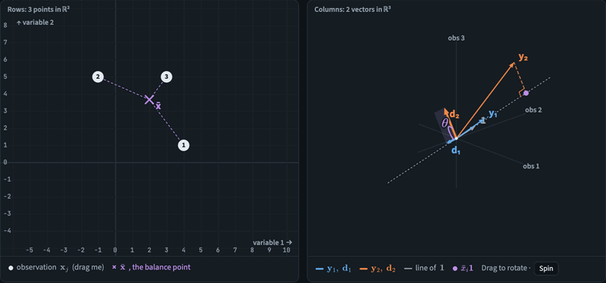
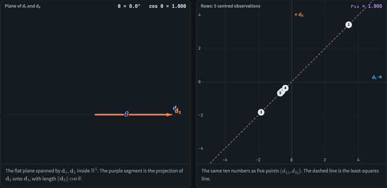
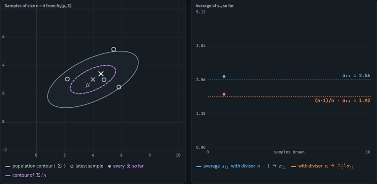
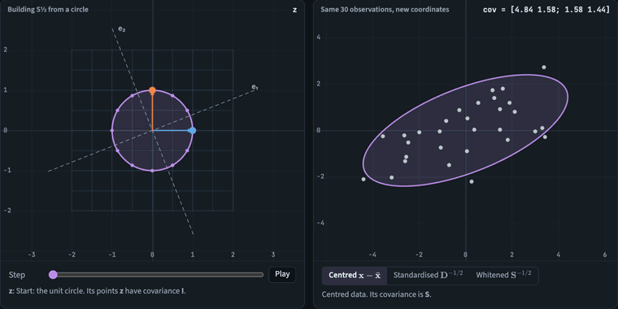
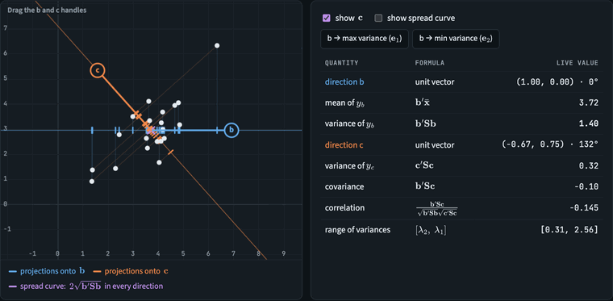
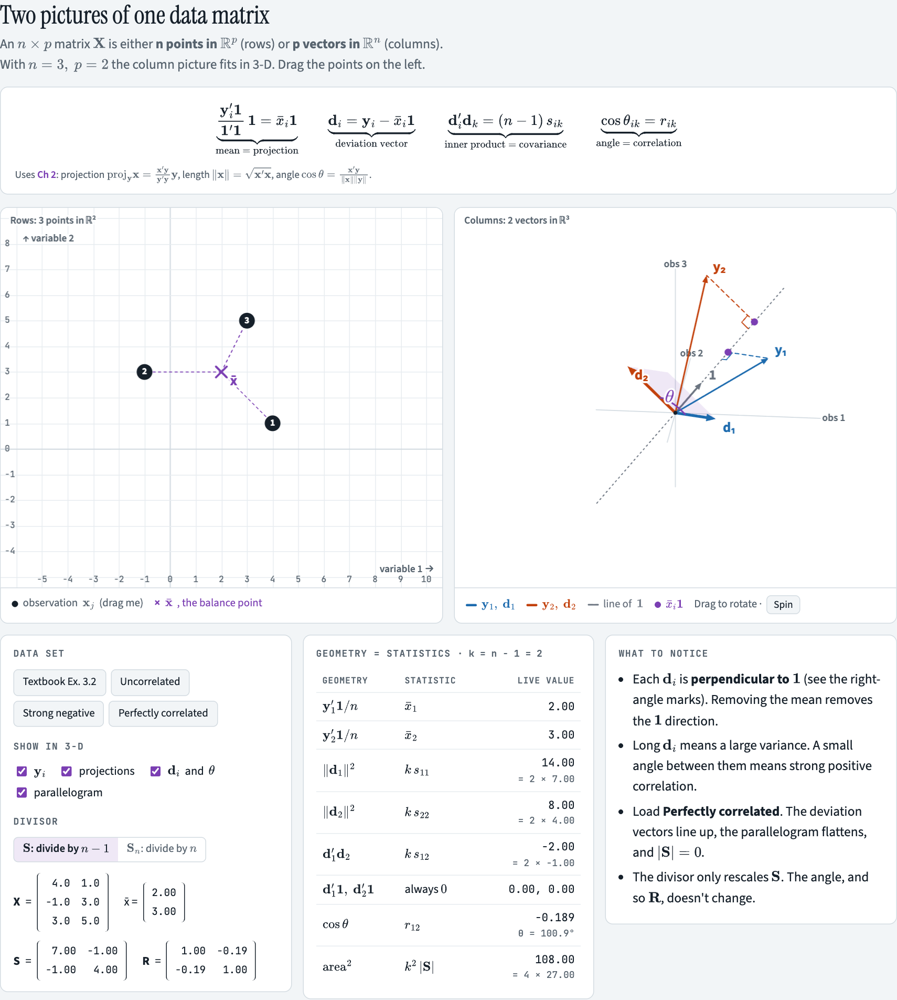
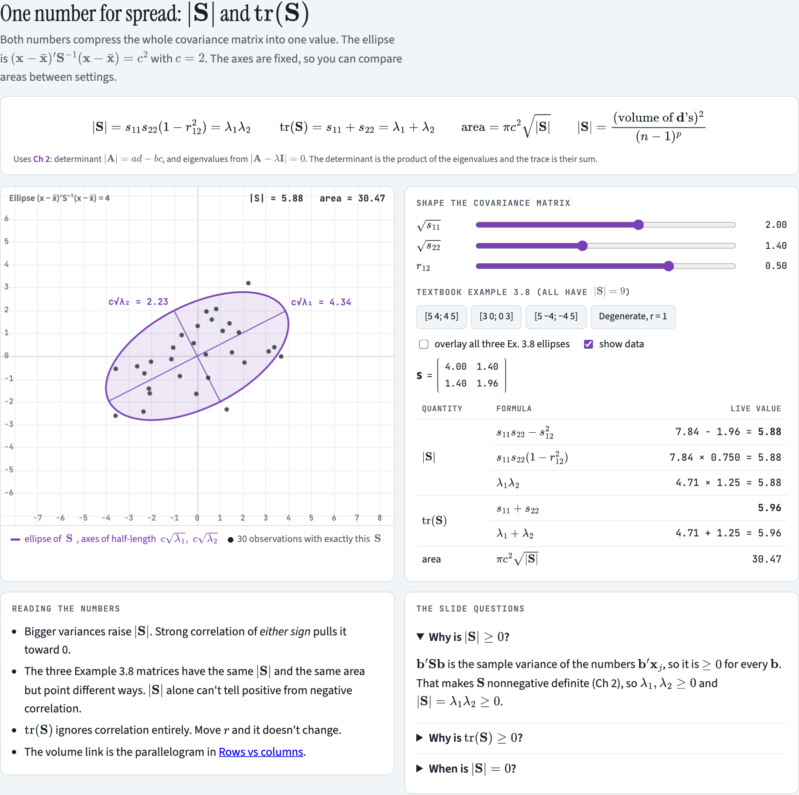
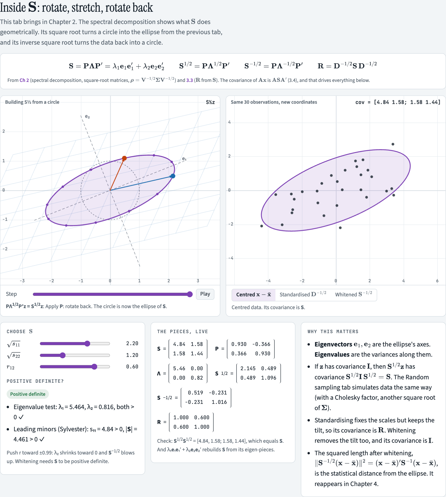
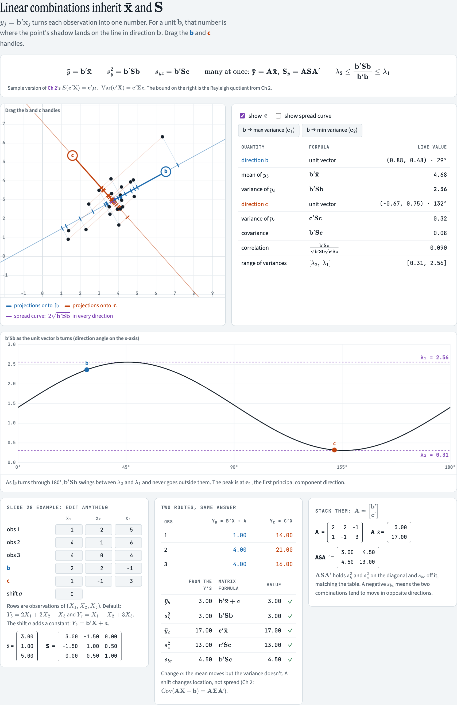
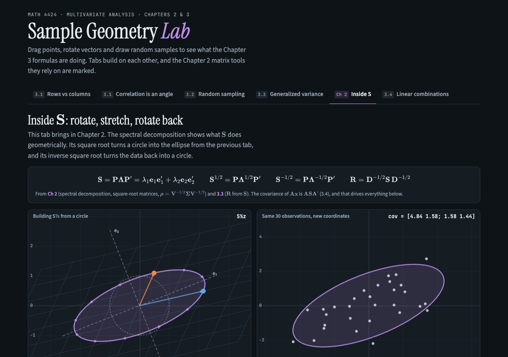

# Sample Geometry Lab

An interactive companion to **MATH 4424 Multivariate Analysis, Chapter 3: Sample Geometry and Random Sampling**, with the Chapter 2 matrix tools it relies on. You drag points, rotate vectors and draw random samples, and every number on the page is recomputed live from what you see.

**▶ Live demo: https://joshrkhoo.github.io/sample-geometry-lab/**

It's one HTML file with no build step and no install. Open `index.html` in a browser, or use the link above.

---

## Demos

### 3.1 Rows vs columns: the mean is a projection, correlation is an angle
Drag an observation in the scatter plot (left). The right panel shows the same data as two column vectors in ℝ³. Each **y**ᵢ is projected onto **1**, which gives x̄ᵢ**1**. What's left over is the deviation vector **d**ᵢ, at right angles to **1**. The cosine of the angle between **d**₁ and **d**₂ is r₁₂, and the squared area of the shaded parallelogram is (n−1)²|S|.

### 3.1 Correlation is the cosine of an angle
This is AI Exploration-1 from the slides. Two centred vectors in ℝ⁵ are swept from θ = 0° (r = 1) through 90° (r = 0) to 180° (r = −1), and the scatter plot follows. A verification table checks that the coordinates sum to zero and computes r by hand.

### 3.2 x̄ and S are random too
The app draws repeated samples from N₂(μ, Σ). The sample means bunch up inside the Σ/n contour. The running average of s₁₁ settles on σ₁₁ with divisor n−1, and on (n−1)/n · σ₁₁ with divisor n.

### Ch 2: Inside S (spectral decomposition and square-root matrices)
A unit circle is turned into the ellipse of **S** one step at a time: rotate by **P**′, stretch by **Λ**^½, then rotate back by **P**. The right panel shows the same 30 observations centred, standardised (**D**^−½, covariance **R**) and whitened (**S**^−½, covariance **I**).

### 3.4 Linear combinations and the Rayleigh quotient
Turn the direction **b** and watch each point's projection onto it. The chart underneath shows **b**′**S****b** swinging between λ₂ and λ₁, with the maximum at the first eigenvector.

---

## What's in each tab

| Tab | Lecture section | You can… |
|---|---|---|
| **Rows vs columns** | 3.1 | Drag 3 observations, rotate the ℝ³ column view, switch between divisors n−1 and n, load textbook Example 3.2 or a degenerate data set |
| **Correlation is an angle** | 3.1 | Set θ and ‖**d**₂‖/‖**d**₁‖ and check r = cos θ by hand (Cauchy–Schwarz gives \|r\| ≤ 1) |
| **Random sampling** | 3.2 | Set n, σ₁, σ₂, ρ and compare simulated E(x̄), Cov(x̄), E(S), E(Sₙ) with theory, with short derivations |
| **Generalized variance** | 3.3 | Shape S and read off \|S\|, tr(S), the eigenvalues and the ellipse area. Includes the three \|S\| = 9 matrices from Example 3.8 and the slide questions (why \|S\| ≥ 0, when \|S\| = 0) |
| **Inside S** | Ch 2 + 3.3 | Spectral decomposition S = PΛP′, S^½ and S^−½, R = D^−½SD^−½, and positive-definiteness tests (eigenvalues, Sylvester) |
| **Linear combinations** | 3.4 | Drag **b** and **c** to see b′x̄, b′Sb and b′Sc. The slide 28 example is editable and computed two ways, with a shift *a* to show that a constant moves the mean but not the variance, and with Ax̄ and ASA′ |

## Screenshots

| | |
|---|---|
|  |  |
|  |  |

Dark mode follows your system setting:

## Key formulas covered

- Mean as a projection: (**y**ᵢ′**1** / **1**′**1**) **1** = x̄ᵢ **1**
- Deviation vectors: **d**ᵢ = **y**ᵢ − x̄ᵢ**1**, with **d**ᵢ′**d**ₖ = (n−1) sᵢₖ and cos θᵢₖ = rᵢₖ
- Sampling: E(X̄) = μ, Cov(X̄) = Σ/n, E(S) = Σ, E(Sₙ) = (n−1)/n · Σ
- Spread: |S| = λ₁λ₂ = (n−1)⁻ᵖ (volume)², tr(S) = λ₁ + λ₂
- Ch 2: S = PΛP′, S^½ = PΛ^½P′, R = D^−½ S D^−½
- Linear combinations: ȳ = b′x̄, s²ᵧ = b′Sb, s_yz = b′Sc, ȳ = Ax̄, Sᵧ = ASA′, λ₂ ≤ b′Sb / b′b ≤ λ₁

## Tech

Plain HTML, CSS and JavaScript, drawn on `<canvas>`. Maths is typeset with [MathJax 3](https://www.mathjax.org/) (SVG output) and fonts come from Google Fonts, so both need an internet connection. Without one, the page still works but shows raw TeX and system fonts. Data in the simulation tabs comes from a seeded random generator, so results are reproducible.

Based on Johnson & Wichern, *Applied Multivariate Statistical Analysis*, as taught in MATH 4424.
